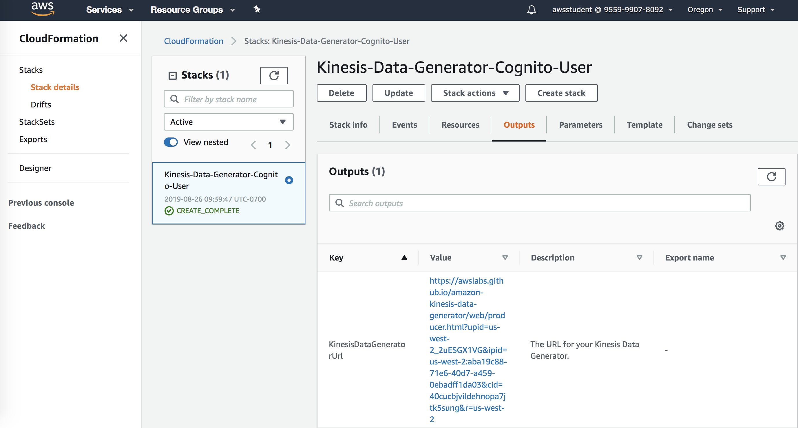
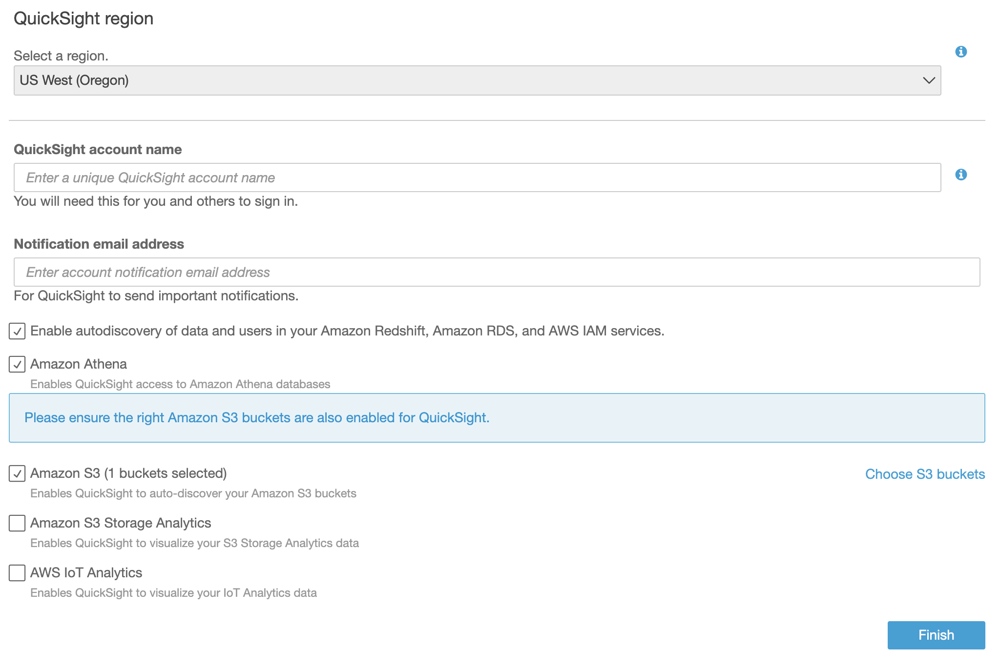

# Analyticon - Data Pipeline

## Section 1 - Laying the data Foundations

### _Set up Kinesis Firehose_

1. Log in in the AWS Console  
2. In the AWS Console, navigate to the Kinesis service (click get started if this is your first time using the kinesis service). Click on : **'Go to the Firehose console'**;
3. Select the **'Create Delivery Stream'** button;
4. Name your delivery stream (e.g. **'toll-data-stream'**);
5. Choose the **'Direct PUT or other sources'** option for Source and choose the **'Next'** button;
6. Leave the **'Record transformation'** option as **'Disabled'**;
7. Leave **'Convert record format'** option as **'Disabled'** and choose **'Next'** button;
8. Select **'Amazon S3'** as data **'Destination'** and choose to create new bucket by pressing the **'Create new'** button in the **'S3 destination'** section;
9. Make sure you specify the same region for the bucket as your delivery stream (e.g. **'US West-2 (Oregon)'**)
10. Leave the **'Prefix'** and the **'Error Prefix'** field blank and choose the **'Next'** button;
11. On the next screen in the **'S3 buffer conditions'**:
    * Set **'Buffer size'** to **'1 MB'**;
    * Set **'Buffer interval'** to **'60 seconds'**;
12. In the **'IAM role'** section, press the **'Create new, or Choose'** button;
13. In the **'IAM window'**, select the **'firehose_delivery_role'** choose allow to grant Kinesis Firehose Read and Write access for record delivery. (keep all defaults);
14. On the **'Review'** screen double-check all the correct settings and choose the **'Create delivery stream'** button.

> Your configuration screen should look similar to this:


### _Explanation about Code or Kinesis Data Generator_

In this step, we will configure IAM access to the AWS account in use to allow data to be published to the Kinesis delivery stream created in step 1 above.

* With your AWS Console open, Open the Kinesis Data Generator in a new tab: [_Amazon Kinesis Data Generator_](https://awslabs.github.io/amazon-kinesis-data-generator/web/producer.html)
* Click on [_Help_](https://awslabs.github.io/amazon-kinesis-data-generator/web/help.html) and select: **'Create a Cognito User with Cloudformation'**;
* This link will take you to the AWS CloudFormation console and start the stack creation wizard. You will need to provide a Username and Password for the user that you will use to log in to the KDG later. Accept the defaults for any other options presented by CloudFormation;
  * Choose **'Template is ready'** and leave **'Template source'** as default.

### _Access the Kinesis Data Generator_

* After the CloudFormation stack has been successfully created, you will need to use a special URL to access the KDG. CloudFormation creates this URL as part of the stack generation, and you can find it in the **'Outputs'** section of the CloudFormation stack;
* To find the URL, choose the CloudFormation stack, and then choose the Outputs tab as shown below. Simply bookmark this URL in your browser for easy future access to the KDG;



* Click on the link in the cloudformation output, and log into the data generator with the username and password you just created in the step above. You are now ready to send sample data to your Kinesis stream.

### _Generate Sample Data_

* Once you have logged into the Kinesis Data Generator by following KinesisdataGeneratorUrl and using the username/password provided, select the Region in which you created the Kinesis Firehose Stream (us-west-2). You should see your stream in the delivery stream dropdown- select it.
* In the record template section, we will specify the data format that the data generator will use to put records onto the stream. Copy and paste this into the Template1 window:
  * <http://amzn.to/2zHpsVB>
  
  ```json
    {{date.now}},
    {{random.weightedArrayElement(
        {
            "weights": [0.1, 0.1, 0.1, 0.1, 0.1, 0.1, 0.1, 0.1, 0.09, 0.01],
            "data": ["183A", "SH130", "TX45", "TX290", "Exit79", "Exit29", "Exit620", "Exit66", "35North", "35South"]
        }
    )}},
    {{random.weightedArrayElement(
        {
            "weights": [0.1, 0.1, 0.1, 0.1, 0.1, 0.1, 0.1, 0.1, 0.1, 0.1],
            "data": ["6LD7N", "JQ3QZ5", "J80DP4", "T4OFLD", "AECZV8", "EDMTT", "ULORSTX", "XHRRET", "UMC6IZ", "XSUEJA"]
        }
    )}}
    ```

* You can now send data to the Kinesis stream (100 records per second recommended)
* **While the data generator is running, you can validat** and monitor records being sent** to the stream by navigating back to the Kinesis Firehose console, selecting the delivery stream created and clicking the **‘Monitoring’** Tab. _(Note-It may take up to 1 min for records to appear on the stream)_

### _Set up tables in Athena_

1. Log in in the AWS Console;
2. In the AWS Console, navigate to the Athena service and click on : **'Get Started'**
3. Make sure you specify the same region for the bucket as your delivery stream (e.g. **'US West-2 (Oregon)'**);
4. In the field below **‘New query 1’.** Run the following queries:
    * To create a new database:

    ```SQL
    CREATE DATABASE toll;
    ```

5. Select the database created (“*toll*”)
6. To create a new table, run the query in the field below *‘New query 1’*:

    ```SQL
    CREATE EXTERNAL TABLE `lab_toll_data_stream`(
      `date` string,
      `toll` string,
      `user` string)
    ROW FORMAT DELIMITED
      FIELDS TERMINATED BY ','
    STORED AS INPUTFORMAT
      'org.apache.hadoop.mapred.TextInputFormat'
    OUTPUTFORMAT
      'org.apache.hadoop.hive.ql.io.HiveIgnoreKeyTextOutputFormat'
    LOCATION
      's3://<YOUR S3 BUCKET HERE>/'
    TBLPROPERTIES (
      'delimiter'=','
    )
    ```

7. to preview your data, run the below query in athena:

    ```SQL
    SELECT * FROM lab_toll_data_stream LIMIT 100;
    ```

### _Set up Quicksight_

1. In the AWS Console, navigate to the Quicksight service;
    * If you have not yet used QuickSight, you will need to sign-up for the service and create a login.




> Set a *‘account name’* and *‘email’*

* Finish the sign-up, and you will be redirected to your QuickSight **dashboard**


* Make sure you specify the same region for the bucket as your delivery stream (e.g. **'US West-2 (Oregon)'** )


1. Click on **‘Manage data’**;
2. After click on **'New data set'**;
3. select **'Athena'** as the data source;
4. set a name on your data source and click on **‘Create data source’**;
5. select your datasource (e.g. **'toll'**) on the drop down box;
6. select your table (e.g. **'lab_toll_data_stream'**) on the check box list;
7. click **‘Select’**;
8. select **‘Directly query your data’**;
9. click **‘Visualize’**.

### _Can you answer?_

* **Which is the busiest Toll Station?**
* **Who is the most active user by license plate?**
* **We have had reports of a sensor failure. Can you identify a toll station that is reporting less traffic?**

## Section 2 - Real Time Analytics

In this exercise, you will will build upon the existing single destination Kinesis Firehose to add real-time analytics and alerting using Kinesis Analytics + Lambda. A Kinesis Analytics application will be configured to connect to the Firehose delivery stream as the data source. Kinesis Analytics allows you to author SQL queries that execute on the source data in real time. A destination stream will also be configured to allow scored records to invoke a lambda function to provide real-time alerting on configured thresholds.

### _Set up Kinesis Analytics_

1. In the AWS Console, navigate to the Cloudformation service;
2. Select **'Create Stack'**;

    

3. Select **'Template'**;
4. Choose to specify an Amazon S3 template URL and paste the following:
    * <https://s3-us-west-2.amazonaws.com/abd321/real-time-workshop.json>
5. Specify a name for your stack (e.g. **'real-time-analysis'**);
6. **(optional)** – In the Parameters field, specify your mobile phone number to receive text messages for detection events. You must use the ITU # standard. For example: +15120000000;
7. Keep all default options and select **'Next'**;
8. Acknowledge the creation of IAM resources in your account. (this is required to supply the services in use with adequate permissions to execute);
9. Click **'Create'**;
10. While the stack is creating, you can monitor stack events by selecting the **‘Events’** tab with your stack name selected;
11. Once the stack has created successfully, the following reference architecture will be configured in your account:


### _Record Analysis_

1. In the AWS Console, navigate to the Kinesis service;
2. Select the Kinesis analytics application [real-time-analysis-FindAnomaliesApplication](https://console.aws.amazon.com/kinesisanalytics/home?region=us-west-2#/wizard/hub?applicationName=real-time-analysis-FindAnomaliesApplication) that was created by Cloudformation;
3. Within application details, select **'Go to SQL Editor'** in Real time analytics;
4. In the Real-time analytics window, you are able to paste SQL and run it in real time against data on the stream. Use this sample SQL code to begin rating data and applying an anomaly percentage score to each record;
    * <http://amzn.to/2AdS3By>
    * **copy and paste the SQL syntax directly into the query window*:

    ```SQL
    CREATE OR REPLACE STREAM "VEHICLES_PER_STATION_STREAM" ("station_id" VARCHAR(10), "vehicle_count" INTEGER);

    CREATE OR REPLACE PUMP "VEHICLES_PER_STATION_STREAM_PUMP" AS INSERT INTO "VEHICLES_PER_STATION_STREAM"
    SELECT STREAM "station_id", COUNT(*) AS vehicle_count
    FROM "SOURCE_SQL_STREAM_001"
    GROUP BY "station_id", STEP("SOURCE_SQL_STREAM_001".ROWTIME BY INTERVAL '10' SECOND);

    CREATE OR REPLACE STREAM "ANOMALY_SCORE_SQL_STREAM" (
    "station_id" varchar(10),
    "vehicle_count" integer,
    "anomaly_score" DOUBLE);
    -- Compute an anomaly score for each record in the vehicle count stream
    -- using Random Cut Forest
    CREATE OR REPLACE PUMP "ANOMALY_SCORE_STREAM_PUMP" AS INSERT INTO "ANOMALY_SCORE_SQL_STREAM"
    SELECT STREAM "station_id", "vehicle_count", "ANOMALY_SCORE" FROM
    TABLE(RANDOM_CUT_FOREST(
    CURSOR(SELECT STREAM "station_id", "vehicle_count" FROM "VEHICLES_PER_STATION_STREAM"),
    1,
    10,
    10,
    2
    )
    );
    ```

5. Once you have copied and pasted the SQL into the query window, select **'Save and run SQL'**;
6. To begin analyzing records navigate back to the Kinesis Data Generator and change the Stream/delivery stream selection to the **'real-time-analysis-KinesisFirehose'** created by cloudformation and click **'Send Data'**;
7. Navigate back to Amazon Kinesis dashboard and select the [real-time-analysis-AnomalyStream](https://us-west-2.console.aws.amazon.com/kinesis/home?region=us-west-2#/streams/details?streamName=real-time-analysis-AnomalyStream)
8. Click on **'Go to SQL results'**;
9. You should now see records on the stream.

> The random_cut_forest function uses an algorithm to classify and assign an anomaly score to records on the stream. Since the function conducts its analysis over a window of time, it is recommended to run the data generator for several minutes prior to simulating an anomaly. You should see the anomalyScore for each record normalize to <1 over time in the real-time analytics tab by selecting the ANOMALY_SCORE_SQL_STREAM.

* Note-Check the **'Scroll to bottom when new results arrive'** check box to automatically refesh the view.

### _Simulating Anomalies_

Once the anomaly scores have normalized, temporarily stop the kinesis data generator and modify the weight value for one or more of the stations to simulate traffic anomalies.

1. Please access [_Amazon Kinesis Data Generator_](https://awslabs.github.io/amazon-kinesis-data-generator/web/producer.html);
2. Select the **'real-time-analysis-AnomalyStream'** and change the weight value on all stations except for 1 to simulate all traffic diverting to one exit. For example:

    ```json
    {{date.now}},
    {{random.weightedArrayElement(
        {
            "weights": [0.02, 0.04, 0.05, 0.06, 0.02, 0.02, 0.02, 0.02, 0.02, 0.1],
            "data": ["183A", "SH130", "TX45", "TX290", "Exit79", "Exit29", "Exit620", "Exit66", "35North", "35South"]
        }
    )}},
    {{random.weightedArrayElement(
        {
            "weights": [0.1, 0.1, 0.1, 0.1, 0.1, 0.1, 0.1, 0.1, 0.1, 0.1],
            "data": ["6LD7N", "JQ3QZ5", "J80DP4", "T4OFLD", "AECZV8", "EDMTT", "ULORSTX", "XHRRET", "UMC6IZ", "XSUEJA"]
        }
    )}}
    ```

3. Once you have modified the weight value click *'Send data'* and return to the Kinesis Analytics tab to view the anomaly_stream. You should see the anomalyscore values change. The function assigns an anomaly score value based on deviation seen.

> If you specified a valid mobile phone number when creating the Cloudformation stack, you may begin receiving anomaly detection alerts

### _Alerting_

As the 'real-time-workshop-FindAnomaliesApplication' processes records on the stream using the random_cut_forest algorithm, appended records are published to the ANOMALY_SCORE_SQL_STREAM with their anomaly_score. This stream is configured as the execution trigger for 'real-time-workshop-SendNotification' lambda function which will output to an SNS message any record with an anomaly_score of 2.5 or higher.

 Lambda Function Code:

```python
from __future__ import print_function

import base64
import json
import boto3

print('Loading function')

PHONE_NUMBER = "+15120000000"
ANOMALY_THRESHOLD = 2.5

sns_client = boto3.client('sns')

def lambda_handler(event, context):
    #print("Received event: " + json.dumps(event, indent=2))
    for record in event['Records']:
        # Kinesis data is base64 encoded so decode here
        payload = base64.b64decode(record['kinesis']['data'])
        print("Decoded payload: " + payload)

        # determine if this is anomalous
        stationData = json.loads(payload)
        if stationData['anomaly_score'] > ANOMALY_THRESHOLD:
  
          notification_txt = 'Anomalous data detected at station {}. Total vehicles detected was {}. The anomaly score was {}, which is greater than your configured threshold of {}'.format(stationData['station_id'], stationData['vehicle_count'], stationData['anomaly_score'], ANOMALY_THRESHOLD)

          sns_client.publish(PhoneNumber=PHONE_NUMBER, Message=notification_txt)

    return 'Successfully processed {} records.'.format(len(event['Records']))
```

If you would like to experiment with the Anomaly_Threshold you can modify the ANOMALY_THRESHOLD = 2.5 value inline via the lambda console. By modifying the station weights in the Kinesis Data Generator, you can experiment with different anomaly and alerting thresholds.

> To easily access the lambda function and other resources created for this workshop, use the **'Outputs'** tab in the real-time-workshop Cloudformation console.


